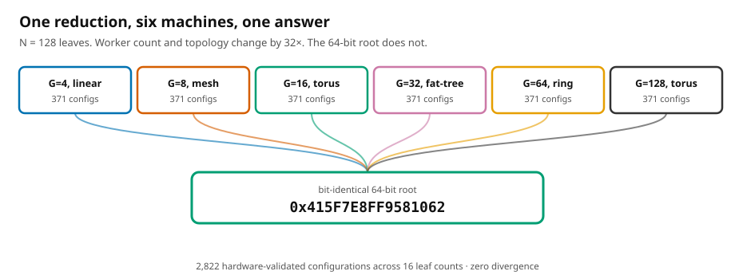

<div align="center">

# SPRS

**Bitwise-reproducible floating-point reduction across cluster reshape.**

A compiler and a network-on-chip that together guarantee the same 64-bit answer
when you change the number of workers, the topology, or the schedule.

[](LICENSE)
[](rtl/)
[](data/results/)
[](#the-result)



</div>

---

## The problem

IEEE 754 addition is not associative. Production collectives — NCCL, MPI, oneCCL —
pick a reduction order to maximise throughput for the worker count and topology
they happen to see. Change either and the order changes, so the last bits change.

Rerun the same training job on 256 GPUs instead of 128, same seed, same data, same
code, and you get **bit-divergent weights by the end of the first iteration**. Then
it compounds. Bit-for-bit regression testing of scientific codes fails the same way,
and in regulated deployments the inability to reproduce a computation across a
hardware refresh is increasingly disqualifying.

## The idea

Reduction order is not a library concern. It is an **interface** concern.

SPRS fixes the operand binding at every internal node of a canonical full binary
tree `FBT(N)`, indexed only by the leaf count `N`. It says nothing about which
worker holds which node, how packets route, or when anything fires — schedulers
stay free to optimise all of that. A fabric that gates execution on a DMEM
scoreboard then makes arrival order unobservable, and the 64-bit root becomes a
pure function of `(N, L)`.

## The result

| | |
|---|---|
| RTL-validated configurations | **2,822** |
| Leaf-count classes | **16** |
| Distinct roots observed per class | **1** — always |
| Bit divergence | **zero** |
| Largest reshape survived | `G=4` linear → `G=128` torus at `N=128` |
| Injected faults caught by the oracle | **84 / 84** |

Each class collapses to exactly one root even though every configuration in it was
produced by a *different compiler pipeline* — a different partitioner, a different
mapper, a different schedule. The tournament is, from the ABI's point of view,
2,822 attempts to break the claim that all failed.

## What we do not claim

- **No measured overhead ratio.** Pricing the ABI honestly needs a non-deterministic
  reducer built on the same fabric with equal engineering effort. We did not build
  one, so we price the cost *structurally* instead and say so. This is the largest
  open item in the evaluation.
- **No silicon numbers.** Everything here is cycle-accurate RTL simulation. FPGA
  bring-up wrappers exist for `G ∈ {2,4}`; no board measurements are reported.
- **39 of 40 instances.** The largest (`8192` leaves × `4096` GPUs, fat-tree) needs
  50–70 GB per elaboration; five attempts each blew the 8-hour cap, burning 58.9
  core-hours for zero results.
- **Not IEEE-754 conformant.** The adder flushes subnormals to zero. Uniformly, so
  reproducibility holds — but our results need not match an external reducer.

## Repository map

```
src/           compiler: 18 assignment × 10 mapping × 12 refinement algorithms
rtl/           the fabric — 10 SystemVerilog files, topology as a parameter
fpga/          Artix-7 bring-up wrappers (G = 2, 4)
benchmarks/    the 40-instance suite
experiments/   phase1/ tournament driver · mutation/ fault injection · rerun/ watchdog
data/          result CSVs and mutation results — the scientific record
paper/main/    the TPDS manuscript, tables and figures generated from data/
paper/companion/  arXiv hardware-implementation reference
tools/         verify_numbers.py — re-derives every headline claim from the CSVs
docs/          design rationale and planning notes
```

**Testbenches are not committed.** The campaign emitted 326 GB of them and they are
deterministic outputs of `src/sprs_core.py`. We ship the generator, not its output.

## Quickstart

```bash
git clone <this repo> && cd sprs
pip install -r requirements.txt

# Re-derive every headline number in the paper from the released data
python3 tools/verify_numbers.py

# Compile one instance, software only
python3 src/sprs_tournament.py --mode phase1 --skip-hw

# Rebuild the paper (tables and figures regenerate from data/)
cd paper/main && make tables && make
```

Hardware simulation additionally needs Vivado (tested on xsim 2025.2):

```bash
export VIVADO_BIN=/opt/Xilinx/2025.2/Vivado/bin
python3 experiments/phase1/_bypass_runner.py --jobs 16 \
        --tb-list-json worklist.json --out-csv results.csv
```

## Two things worth knowing before you trust a cycle count

**Take the max over PEs, not PE 0.** Our first campaign recorded PE 0's performance
counter as the makespan. When the reduction root lands elsewhere — routine on rings
and tori — PE 0 idles early and its counter understates end-to-end latency. 54% of
rows were wrong; 140 fell below a *proven lower bound*, one reading 5 cycles against
a bound of 192. Fixed in `experiments/phase1/_bypass_runner.py`, which now also
persists the full per-PE vector.

**Route-table bypass is exact for bits, not for cycles.** Rewriting the clocked
`write_route()` protocol as hierarchical assignment saves `O(G²)` simulated cycles
and is bit-exact for the root — every invariance result is unaffected — but roughly
41% of cycle counts settle 1–54% lower. Disclose it wherever you quote cycles.

## Citation

See [`CITATION.cff`](CITATION.cff).

## License

Apache 2.0. See [`LICENSE`](LICENSE).
